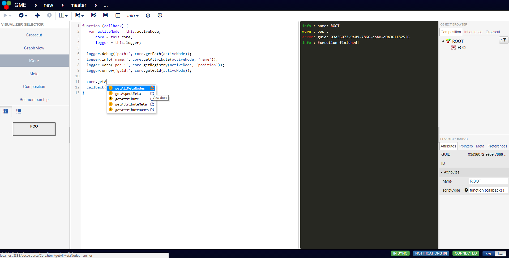

# ICore
Code-editor for interacting with models uses the same APIs available from a plugin (the provided context is the main function of a plugin).
Note that this visualizer uses `eval` to evaluate the code and is recommended to only be used at dev-deployments or at least not at deployments where security is a major concern.

### [View instruction video here!](https://youtu.be/gDvLnR0iDJQ)




The editor provides code completion for the major webgme APIs and dynamically generates the current META. To bring up the suggestions hit [Ctrl + Space] (links to the source code documentation are available). For better user-experience do not rename the variables providing the APIs.

- See [ICoreDefaultConfig](src/visualizers/panels/ICore/ICoreDefaultConfig.json) for options.

## Importing into other repository
```
webgme import viz ICore webgme-icore
```

Once imported and server is restarted, register the visualizer at the nodes where it should be used. If the `'scriptCode'` attribute (configurable) isn't defined the model will have meta-violations after saving the code.

### Python specifics
In general we do not recommend to use the python mode unless the users on the deployment
are trustworthy and/or the deployment doesn't deal with sensitive data.

In order to enable python execution you need to import the `PyCoreExecutor` plugin.

```
webgme import plugin PyCoreExecutor webgme-icore
```

and `config.plugin.allowServerExecution = true;` must be added in the config.

Since the python mode will run user defined code on the back-end we strongly recommend using
[webgme-docker-worker-manager](https://www.npmjs.com/package/webgme-docker-worker-manager).
together with a version of `./DockerfilePyCoreExecutor`. (For an example of the configuration parameters
needed for this to work check out `./config/config.docker.js` and `./docker-compose.yml`.)

Finally import the router that serves the python source code documentation:
```
webgme import router BindingsDocs webgme-bindings
```

## Developers

### Docker compose
If running on unix-like system this repo can be launched using docker-compose.
See `./docker-compose.yml` for useful commands and details.

```docker-compose up -d```

Visit `localhost:8888` from your browser.

Notes:
 - The database-files will be persisted inside the container and the blob-files inside the webgme-server container.
 - The webgme-server launches "docker-workers" on the host machine.

### Running at host
Make sure the [dependencies for webgme](https://github.com/webgme/webgme/blob/master/README.md#dependencies) are installed.
 1. Clone this repository
 2. `npm install` - installs all dependencies
 3. `npm install webgme` - installs webgme (it's a [peer-dependency](https://nodejs.org/en/blog/npm/peer-dependencies/)).
 4. Launch a local mongodb instance (if not local edit the webgme config).
 5. `npm start`
 6. Visit localhost:8888 from a browser.


### Publish new release at npm
 ```
 npm version 1.0.0 -m "Release %s"
 git push origin master
 git checkout v1.0.0
 git push origin v1.0.0
 npm publish ./
 ```
