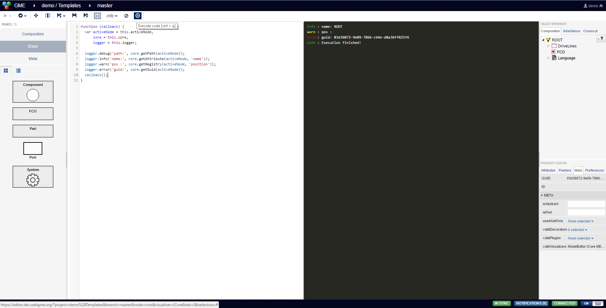

# ICore
Code-editor for interacting with models uses the same APIs available from a plugin (context is the main function of a plugin).
Note that this visualizer uses `eval` to evaluate the code and is recommended to only be used at dev-deployments or at least not at deployments where security is a major concern.

- See [ICoreDefaultConfig](src/visualizers/panels/ICore/ICoreDefaultConfig.json) for options.



## Importing into other repository
```
webgme import viz ICore webgme-icore
```

Once imported and server is restarted, register the visualizer at the nodes where it should be used. If the `'scriptCode'` attribute (configurable) isn't defined, 
you won't be able to save the code in the model.